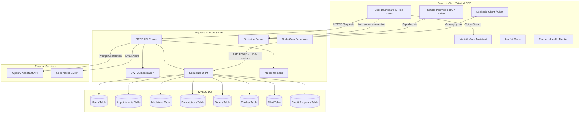

# 🏥 NeoCare — Healthcare SaaS Platform

NeoCare is a state-of-the-art Healthcare SaaS Platform designed to streamline medical consulting, prescription management, and medicine order fulfillment. It features real-time chat, P2P video teleconsulting via WebRTC, and an AI-driven health assistant.

---

## 🏗️ System Architecture



---

## ✨ Key Features

### 👤 Role-Based Portals
*   **Patients**: Book appointments, consult doctors via video calls, order prescribed medicines, track health parameters, and chat with an AI doctor.
*   **Doctors**: Manage schedules, conduct live teleconsultations, write digital prescriptions, and view patient health trackers.
*   **Pharmacists**: Manage medicine inventory (stock, pricing, expiry), dispense prescriptions, and process orders.
*   **Admins**: Manage users, approve medicine updates, approve credit requests, and view system analytics.

### 🎥 Live Teleconsultation & Chat
*   **Real-time Chat**: Fully integrated chat system powered by Socket.io.
*   **WebRTC Video Consultations**: High-quality Peer-to-Peer video sessions directly in the browser (powered by `simple-peer`).

### 🤖 AI Health Engine
*   **AI Chatbot**: Intelligent chatbot assistant powered by OpenAI API.
*   **Vapi AI Integration**: Voice-activated digital assistant support.

### 💳 Credit & Penalty Engine
*   **Credit Requests**: System credits used for service fees.
*   **Cron-scheduled Penalty System**: Background cron job rewards credits back to users if requests/actions are delayed past threshold limits.

---

## 🛠️ Technology Stack

*   **Frontend**: React (V19), Vite, Tailwind CSS v4, Framer Motion, Recharts, Leaflet, Simple-Peer, Vapi AI SDK.
*   **Backend**: Node.js, Express, Socket.io, Node-Cron, Multer, Sequelize ORM.
*   **Database**: MySQL.
*   **External APIs**: OpenAI API, Gmail SMTP (Nodemailer).

---

## 🚀 Getting Started

### Prerequisites
*   [Node.js](https://nodejs.org/) (v16+ recommended)
*   [MySQL](https://www.mysql.com/) database server running locally

### 1. Database Setup
1.  Log into your MySQL server and create a new database:
    ```sql
    CREATE DATABASE neocare_db;
    ```

### 2. Backend Setup
1.  Navigate to the `backend` directory:
    ```bash
    cd backend
    ```
2.  Install dependencies:
    ```bash
    npm install
    ```
3.  Configure your environment variables. Create a `.env` file in the `backend` folder:
    ```ini
    PORT=5000
    DB_HOST=localhost
    DB_USER=root
    DB_PASSWORD=your_mysql_password
    DB_NAME=neocare_db
    DB_PORT=3306
    JWT_SECRET=your_jwt_secret_key
    JWT_EXPIRE=7d
    EMAIL_HOST=smtp.gmail.com
    EMAIL_PORT=587
    EMAIL_USER=your_email@gmail.com
    EMAIL_PASS=your_email_app_password
    OPENAI_API_KEY=your_openai_api_key
    FRONTEND_URL=http://localhost:3000
    ```
4.  Seed the database with initial Doctors and Medicines data:
    ```bash
    node seed.js
    ```
5.  Start the backend development server:
    ```bash
    npm run dev
    ```

### 3. Frontend Setup
1.  Navigate to the `frontend` directory:
    ```bash
    cd ../frontend
    ```
2.  Install dependencies:
    ```bash
    npm install
    ```
3.  Start the frontend application:
    ```bash
    npm run dev
    ```

The application will be accessible at the URL printed in your terminal (usually `http://localhost:5173` or as configured in Vite).

---

## 📁 Project Directory Structure

```text
neocare-healthcare-platform/
├── backend/
│   ├── config/            # Database and Sequelize configuration
│   ├── controllers/       # Route controllers (Auth, Meds, Appointments, etc.)
│   ├── models/            # Sequelize database models
│   ├── routes/            # Express router routes
│   ├── scripts/           # DB Utilities
│   ├── uploads/           # User/system uploaded files (ignored by git)
│   ├── server.js          # Main Express app and Socket.io engine
│   └── seed.js            # Initial database seeder
├── frontend/
│   ├── public/            # Static assets
│   ├── src/
│   │   ├── components/    # Reusable UI Components
│   │   ├── pages/         # Application Views/Pages
│   │   └── App.jsx        # Routing & Main Layout configuration
│   ├── tailwind.config.js # Tailwind CSS styles setup
│   └── vite.config.js     # Vite builder setup
└── README.md
```
